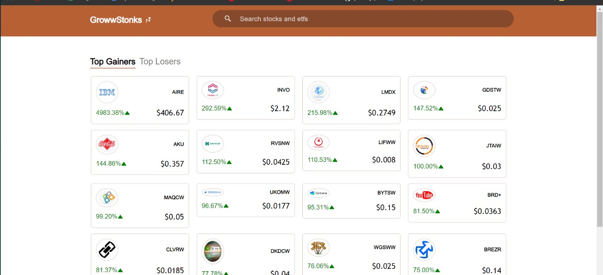
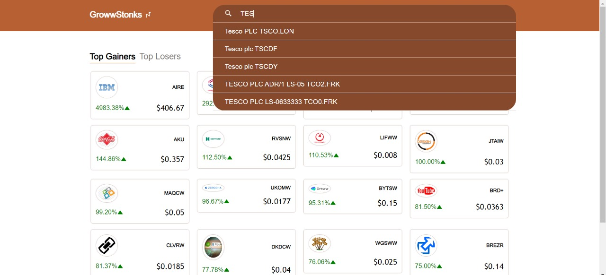
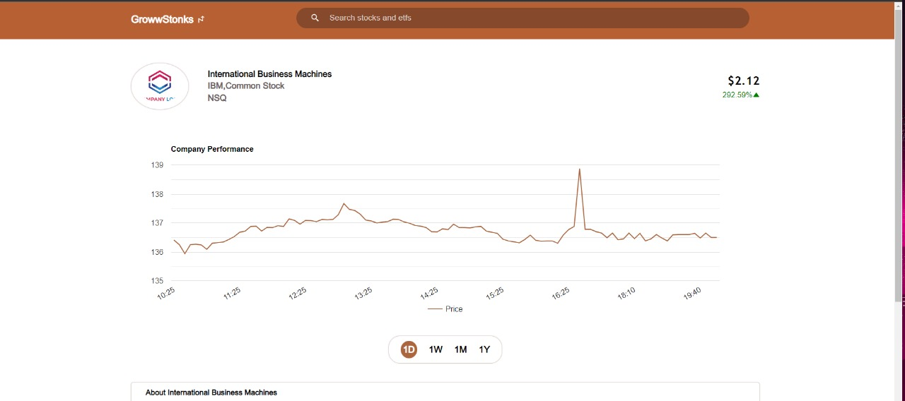
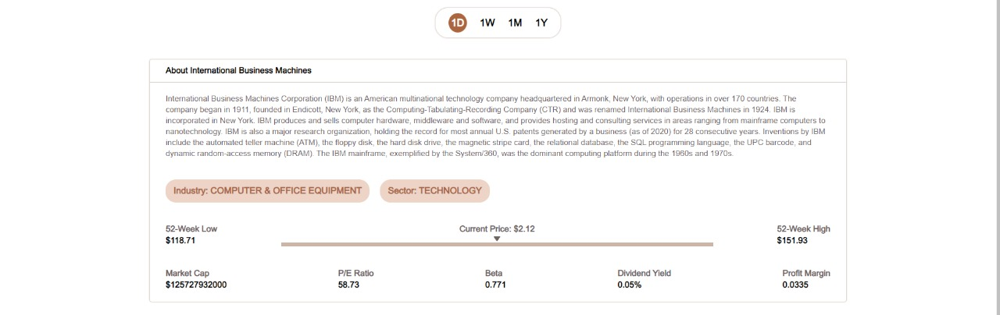

# GROWWWSTONKS
Frontend Assignment

## Introduction
GrowwStonks is a web application where users can track the performance of stocks.It all shows the top 20 Gainers and Losers stocks.

## Features
- Users can view top Gainers and Losers
- Users can search for any stock in the search bar
- User can view detaied information of each stock
- User can track the performance of each stock using Line graph.

## NOTE
- The API which i am using has following limits: 5 REQUEST PER MINUTE AND 100 REQUEST PER DAY.
- So there might be some case where the number of request have reached maximum that's why the data must be not loading, In that case kindly retry in some time, or add the api key env in .env.local folder as "API_KEY" variable and run in local.
- Logo Images was not provided in the API , so I have used some sample images.

## Points Implemented
- Used API from https://www.alphavantage.co/ to show data of stocks.
- Handled Error and Empty for cases
- Followed well defined folder structure
- Deployed the code on render
- Used React Google Charts for Charts UI
- Cached API response wherever necessary
- Implemented Debouncing on Search to limit number of API request
- Implemented server side rendering wherever possible

## How to use
`npm install`
 
`npm run dev`

## Dependencies
- NextJS framework
- React Library
- React Google Charts for Charts UI
- React Icons

## Screenshots

## Deployment
- Link : https://digital-wall-rtzw.onrender.com
- Deployed on Render
